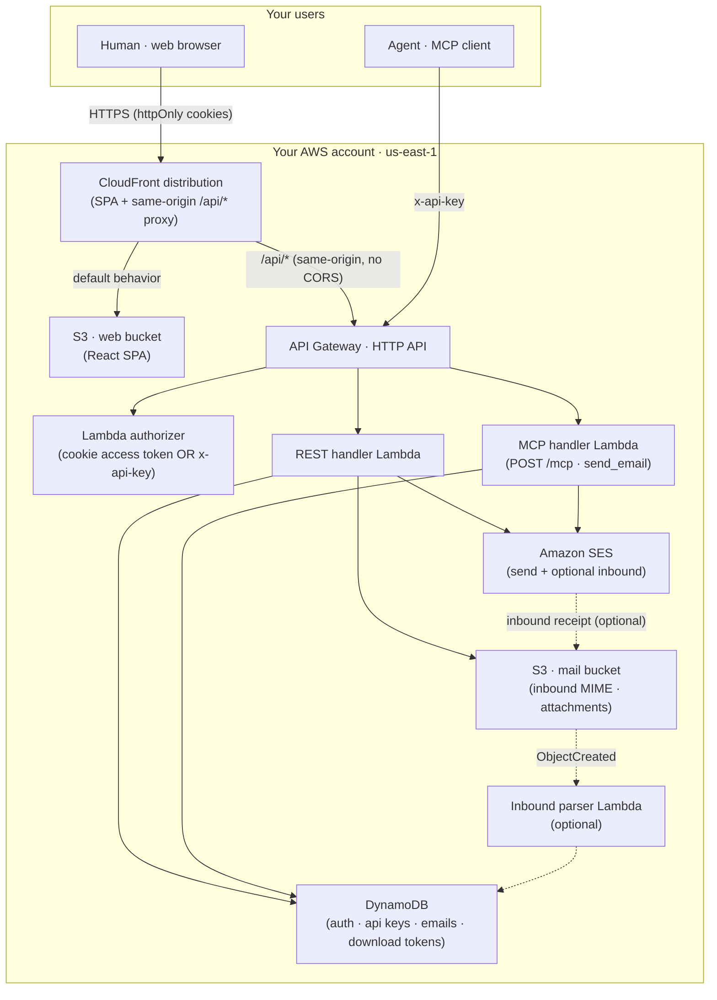

# FreeMail

Self-hosted, single-tenant, open-source email for **agents and humans**, built on AWS SES.

Deploy it into **your own AWS account** and you get:

- a **web app** to send and (optionally) read email under your own domain,
- an **MCP server** so your agents can send email with a `send_email` tool, and
- effectively **unlimited addresses** on your domain — one deployment, one owner, your data.

One `cdk deploy` stands the whole thing up. See [`DESIGN.md`](./DESIGN.md) for the architecture rationale and firmed decisions, and [`docs/DEPLOY.md`](./docs/DEPLOY.md) for the full deploy walkthrough.

## Architecture



**How it fits together.** The React SPA is served from a private S3 bucket via CloudFront. The **same CloudFront distribution proxies `/api/*` to the HTTP API**, so the browser only ever talks to one origin — that lets the session ride in `HttpOnly; Secure; SameSite=Strict` cookies with **no CORS and no token in web storage**. Agents skip the browser entirely and call the HTTP API directly with an `x-api-key` header. A single Lambda authorizer accepts either credential. Sending goes through Amazon SES; metadata and hashed secrets live in DynamoDB; raw inbound mail and attachments live in S3. Inbound is **off by default** — when enabled, SES writes received mail to S3 and a parser Lambda indexes it.

## Capabilities and limitations

| Area             | Shipped                                                                                                                                           | Not yet (roadmap)                                                                                                                                                                         |
| ---------------- | ------------------------------------------------------------------------------------------------------------------------------------------------- | ----------------------------------------------------------------------------------------------------------------------------------------------------------------------------------------- |
| **Send**         | REST `POST /emails` and MCP `send_email`, from any address under your domain                                                                      | —                                                                                                                                                                                         |
| **Agent access** | MCP `send_email` tool via `x-api-key`                                                                                                             | MCP **read** tools (`list_emails`/`get_email`) — [#13](https://github.com/Nan0416/FreeMail/issues/13)                                                                                     |
| **Read**         | Web inbox + reader (sandboxed HTML render), attachment download — **when inbound is enabled**                                                     | —                                                                                                                                                                                         |
| **Inbound**      | Optional SES receipt → S3 → parse → index                                                                                                         | —                                                                                                                                                                                         |
| **Attachments**  | Up to **~7 MB total per send**; files over 3 MB become **token-download links** (`/d/{token}`, 30-day expiry)                                     | Direct upload of truly large (>10 MB) files — [#34](https://github.com/Nan0416/FreeMail/issues/34); download-token revoke endpoint — [#35](https://github.com/Nan0416/FreeMail/issues/35) |
| **Auth**         | Single password (web) via httpOnly cookies; API keys (agents) authorize **sending only** (mailbox reads + key management need the cookie session) | —                                                                                                                                                                                         |
| **Region**       | `us-east-1` only (inbound SES + CloudFront ACM both require it)                                                                                   | Other regions are unsupported                                                                                                                                                             |

## Monorepo layout

| Package            | Purpose                                                 |
| ------------------ | ------------------------------------------------------- |
| `packages/shared`  | Shared TypeScript types, config schema, utilities       |
| `packages/service` | Lambda handlers — REST API + MCP server                 |
| `packages/web`     | React single-page app (login, compose, inbox, key mgmt) |
| `packages/infra`   | AWS CDK app (the single `FreeMailStack`)                |
| `packages/cli`     | `freemail init` deploy-configuration CLI                |

## Prerequisites

- **Node.js 22** (see [`.nvmrc`](./.nvmrc); Node ≥ 20.19 also works)
- An **AWS account** with credentials configured, and **region `us-east-1`** (the only supported region)
- A **domain** you control, with a Route53 hosted zone (existing, or one FreeMail creates for you)

## Quickstart

```sh
git clone https://github.com/Nan0416/FreeMail.git
cd FreeMail
npm install
npm run build            # type-checks + compiles every package, incl. the web SPA

npx freemail init        # interactive prompts → writes freemail.config.json

cd packages/infra
npx cdk bootstrap        # first time per account/region
npx cdk deploy           # deploys FreeMailStack, reads ../../freemail.config.json
```

After the deploy:

1. Open the **`WebAppUrl`** from the stack outputs and **set your password** on first visit.
2. **Request [SES production access](https://docs.aws.amazon.com/ses/latest/dg/request-production-access.html)** — SES starts every account in _sandbox_ mode (verified recipients only). This is a one-time, **manual, per-AWS-account** step that cannot be automated.
3. To let agents send, create an **API key** in the web app (shown once) and hand it to your agent as `x-api-key`.

Full walkthrough — hosted-zone setup, custom domains, inbound, DNS records, and troubleshooting — is in **[`docs/DEPLOY.md`](./docs/DEPLOY.md)**.

## Agent / MCP example

FreeMail exposes a stateless MCP server at **`POST {api}/mcp`**, authenticated with the API key you created in the web app. The single tool is **`send_email`**.

```jsonc
// MCP client config — point your agent at the FreeMail MCP endpoint.
{
  "mcpServers": {
    "freemail": {
      "url": "https://<your-api-endpoint>/mcp", // ApiEndpoint output, or your apiDomain
      "headers": { "x-api-key": "fm_<your-api-key>" },
    },
  },
}
```

```jsonc
// send_email requires: `from` (under your domain), at least one recipient
// across to/cc/bcc, and at least one body — text and/or html.
{
  "name": "send_email",
  "arguments": {
    "from": "assistant@yourdomain.com",
    "to": ["someone@example.com"],
    "subject": "Hello from my agent",
    "text": "Sent through FreeMail's MCP server.",
  },
}
```

> The MCP server currently offers **`send_email` only**. Reading email from an agent (`list_emails`/`get_email`) is roadmap ([#13](https://github.com/Nan0416/FreeMail/issues/13)); humans read in the web app.

## Development

```sh
npm run build         # tsc -b + web build
npm test              # vitest across all workspaces
npm run lint          # eslint
npm run format:check  # prettier --check (CI gate)
npm run format        # prettier --write
```

CI (`.github/workflows/ci.yml`) runs `format:check` → `lint` → `build` → `test`. Per-package scripts work too, e.g. `npm run build -w @freemail/shared`.

## Contributing

Contributions are welcome. Fork the repo, create a feature branch, and open a pull request:

1. `npm install` then `npm run build` to confirm a clean baseline.
2. Keep the tree formatted and green: `npm run format`, `npm run lint`, `npm test`.
3. Open a PR against `main` describing the change; CI must pass.

## License

[MIT](./LICENSE) © 2026 Nan Qin.
